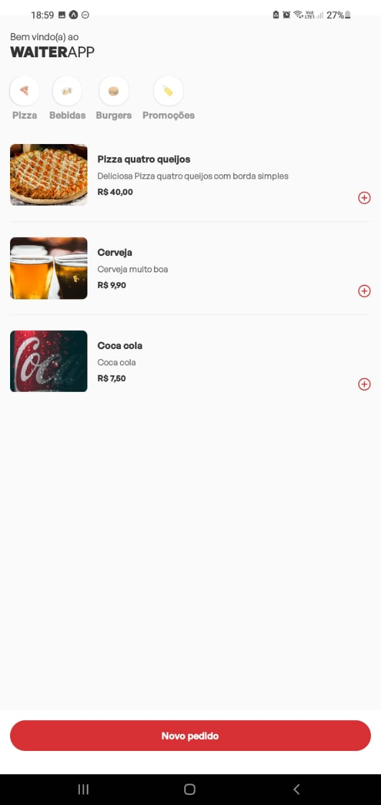
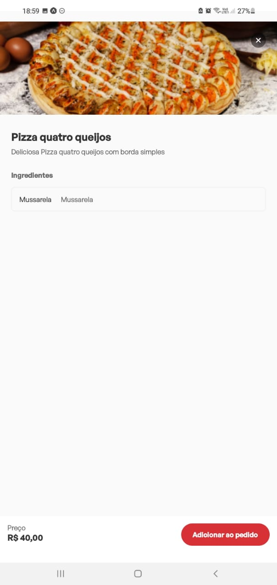
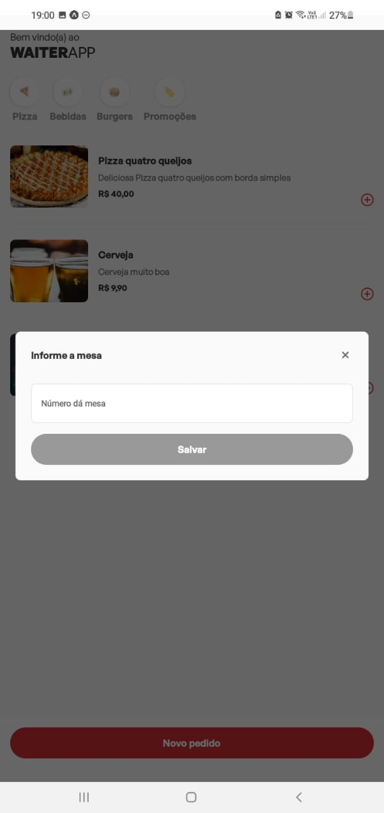
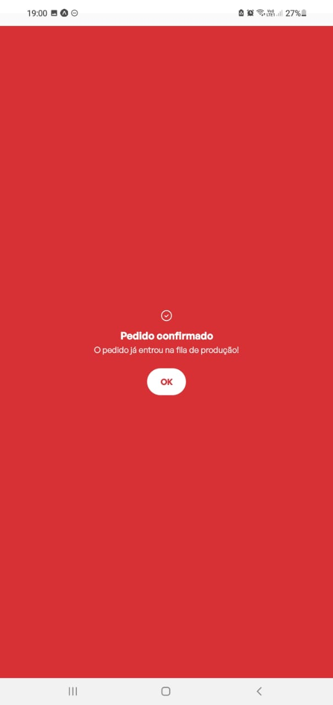

# WAITER-APP-MOBILE;

## Começando.

Bem-vindo ao Waiter App Mobile! Este projeto é um aplicativo para garçons, projetado para facilitar o processo de anotação de pedidos dos clientes. Com esta ferramenta, os garçons podem selecionar a mesa correspondente e registrar os pedidos de alimentos e bebidas de forma rápida e eficiente. Além disso, o aplicativo utiliza a tecnologia de websockets para fornecer uma atualização em tempo real dos pedidos na dashboard, eliminando a necessidade de atualizar a página manualmente.

## Funcionalidades Principais.

- Registro de pedidos: Os garçons podem selecionar a mesa onde o pedido está sendo feito e escolher os itens solicitados pelos
  clientes.
- Atualização em tempo real: Através da implementação de websockets, a dashboard é atualizada instantaneamente após a confirmação do pedido, sem a necessidade de atualizar a página.

## 📋 Pré-requisitos

Para você rodar o projeto em sua maquina local você necessita ter essas tecnologias já instaladas ou você pode instalar:

- NodeJs: você pode instalar ([clicando aqui](https://nodejs.org/en/download/)).

- Yarn: você pode instalar o yarn ([clicando aqui](https://classic.yarnpkg.com/lang/en/docs/install/#debian-stable)).

## Executando o projeto em seu ambiente de desenvolvimento

Siga estas etapas para executar o projeto em seu ambiente de desenvolvimento:

# 1. Instale as dependências

No diretório do projeto, execute o seguinte comando para instalar as dependências necessárias:

```
yarn install
```

# 2. Inicialize o projeto

Para inicializar o projeto, utilize o seguinte comando:

```
yarn start
```

# 3. Instale o aplicativo do EXPO em seu dispositivo móvel

Após executar "yarn start", você pode instalar o aplicativo do EXPO em seu dispositivo móvel. O aplicativo do EXPO está disponível para Android e iOS.

# 4. Conecte-se ao projeto

Abra o aplicativo do EXPO em seu dispositivo móvel e escaneie o QR Code exibido no terminal ou no navegador. Assim, você poderá visualizar o aplicativo e as modificações que você fizer serão exibidas em tempo real.

Agora você pode desfrutar do Waiter App Mobile em seu ambiente de desenvolvimento e realizar testes e modificações de forma fácil e prática.

## Demostração do APP:

<p>- HOME:<p>


<br><br>

<p>- DESCRIÇÃO DE UM ITEM DO CARDÁPIO:<p>


<br><br>

<p>- MODAL PARA SELECIONAR MESA DO CLIENTE:<p>


<br><br>

<p>- HOME COM PEDIDOS SELECIONADOS:<p>


<br><br>

<p>- MODAL DO PEDIDO CONFIRMADO:<p>


<br><br>

## ✒️ Autor

- [Mateus](https://github.com/mateusfelixdias).
